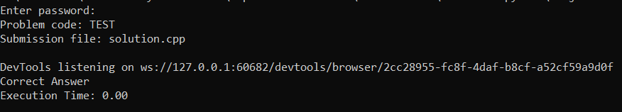

# AutoSubmitCode - Automated CodeChef Solution Submission

<p align="center">
  
</p>


Welcome to AutoSubmitCode, your solution submission assistant for CodeChef problems! This Python program streamlines the process of submitting your code solutions to CodeChef by automating the submission procedure. Say goodbye to manual submissions and enjoy the convenience of having your solutions uploaded and submitted seamlessly.

## How It Works

AutoSubmitCode is designed to simplify the process of submitting your solutions to CodeChef. Follow these steps to enjoy the automation:

### Prerequisites

- Python 3.x
- Chrome browser
- ChromeDriver executable (`chromedriver.exe` included in the repository)

## Usage

1. Type your solution to a CodeChef problem in your favorite IDE and save the file as `solution.cpp`.

2. Run the `codechef_automation.py` program:
   ```sh
   python codechef_automation.py
   ```

3. Follow the prompts to provide your CodeChef credentials and the problem code.

4. Watch as the program automatically navigates to CodeChef, logs in using your credentials, submits your solution, and displays the result.

## Project Files

- `result.png`: Screenshot demonstrating the successful automation of solution submission.
- `solution.cpp`: Example solution code to a CodeChef problem.
- `codechef_automation.py`: The Python script responsible for automating the submission process.
- `chromedriver.exe`: ChromeDriver executable for browser automation.
- `readme.md` (this file): Project documentation providing detailed explanations and instructions.

---

Enjoy the convenience of automating your CodeChef solution submissions with **CodeChef Automation**! If you encounter any issues or have suggestions for improvement, please don't hesitate to open an issue or contribute to the project. Your feedback is valuable in making this automation tool even better.
